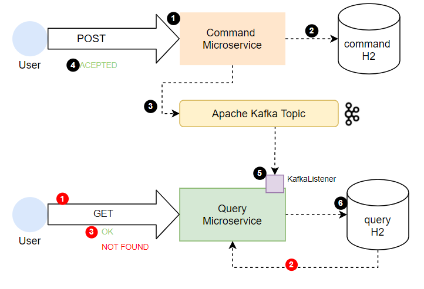

<p align="left">
  <a href="https://github.com/drubioa/demo-cqrs-kafka/actions"></a>
</p>


# Demo for CQRS with Spring Boot Projects and  Apache Kafka
The main propose of this project is test CQRS with Event Sourcing.  

## Getting Started

This project consist of two microservices developed in Spring Boot (Once for Command Service and other for Query Services). Each of them has H2 database for Command and Query. 

### Microservice Command
Once request for POST new Item, after data was inserted in database, it will publish message in kafka broker. 
```
curl --location --request POST 'localhost:8081/phone' \
--header 'Content-Type: application/json' \
--data-raw '{
    "name": "iphone12",
    "model": "11",
    "color": "red",
    "price": 800.99
}'
```
### Microservice Query
Next the query service Kafka Listener will recive the message and save the new item in query H2 database. 
In addition we have a endpoint for get Items presents in query database.

This funcionality could be test made POST request to add new Phone in command service.
```
curl --location --request GET 'localhost:8083/phone/iphone12'
```

Esta llamada puede devolver 404 en caso de que no exista el teléfono, o bien 200 y el json con información del dispositivo.



## Requisitos
* Docker and docker-compose

## Instalación
For make this demo we dispose of `docker-compose.yml`. This *yaml* raise up containers with kafka, zookeepr, a container with query spring-boot project and other with command spring boot project.
```bash
docker-compose up -d
```

